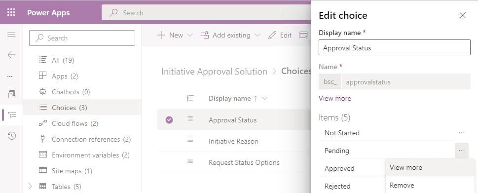
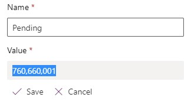

# Approval Request App using Power Apps

This sample solution provides you with a framework to create an approval request app with Power Apps and Power Automate

> [Note]
> This solution includes Dataverse, so your users would be required to have [the necessary Power Apps license](https://docs.microsoft.com/en-us/power-platform/admin/powerapps-flow-licensing-faq#how-is-microsoft-power-apps-and-power-automate-licensed).
   
## Solution Steps Overview

    * Import the solution to your Power Platform environment
    * Locate Publisher's Prefix for your solution
    * Find the ID for Pending Approval Status
    * Update Environment Variables

## Import the solution to your Power Platform environment

Download the zipped Initiative Approval solution file from this repo folder. Find the right environment in the [Power Apps maker portal](https://make.powerapps.com/) within your tenant. Then [import the solution into your environment](https://docs.microsoft.com/en-us/powerapps/maker/data-platform/import-update-export-solutions).

When you get to the Connection References step, select any existing connection in your tenant. If you don't have an existing connection, click to create a new connection.

## Locate Publisher's Prefix for your solution

After your solution has successfully been imported, [find the Publisher Prefix of your imported solution](https://docs.microsoft.com/en-us/powerapps/maker/data-platform/create-solution#change-a-solution-publisher).  Copy and hang on to this prefix value, since you will need to reference it later.

## Find the ID for Pending Approval Status

Click to open the "Initiative Approval Solution" > Choices in left navigation > "Approval Status" choice > Pending

Copy the number inside of the Value text field (e.g., 760660001 using example below) and hang on to this value, since you will need to reference it later.

Click Cancel to go back to your solution.

## Update Environment Variables
