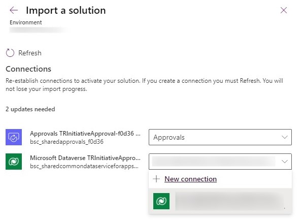

# Approval Request App using Power Apps

This sample solution provides you with a framework to create an approval request app with Power Apps and Power Automate

> [Note]
> This solution includes Dataverse, so your users would be required to have [the necessary Power Apps license](https://docs.microsoft.com/en-us/power-platform/admin/powerapps-flow-licensing-faq#how-is-microsoft-power-apps-and-power-automate-licensed).
   
## High-Level Components of the Solution

1. A canvas app for requestor to initiate approval

   
   
3. A Model Driven app for administrators to view all approvals in all stages within the organization
4. A cloud flow that automate approval requests for approvers through [pre-built approvals connector](https://docs.microsoft.com/connectors/approvals)
5. A cloud flow that accounts for assigned approver and number of approval rounds for the organization

## Steps Overview to Import the Solution

    * Import the solution to your Power Platform environment
    * Locate Publisher's Prefix for your solution
    * Find the ID for Pending Approval Status
    * Update Environment Variables
    * Add Approvers in Setup Table
    * (Optional) Publish MDA App
    * (Optional) Add Office 365 profile pictures

## Import the solution to your Power Platform environment

Download the zipped Initiative Approval solution file from this repo folder. Find the right environment in the [Power Apps maker portal](https://make.powerapps.com/) within your tenant. Then [import the solution into your environment](https://docs.microsoft.com/en-us/powerapps/maker/data-platform/import-update-export-solutions).

When you get to the Connection References step, select any existing connection in your tenant. If you don't have an existing connection, click to create a new connection.

   

## Locate Publisher's Prefix for your solution

After your solution has successfully been imported, [find the Publisher Prefix of your imported solution](https://docs.microsoft.com/en-us/powerapps/maker/data-platform/create-solution#change-a-solution-publisher).  Copy and hang on to this prefix value, since you will need to reference it later.

## Find the ID for Pending Approval Status

Click to open the "Initiative Approval Solution" > Choices in left navigation > "Approval Status" choice > Pending

   

Copy the number in the Value text field and remove the periods (e.g., 760660001 using example below) and hang on to this value, since you will need to reference it later.

   

Click Cancel to go back to your solution.

## Update Environment Variables

Click Environment Variables in left navigation pane of the solution.  Then update the following environment variables:

1. "Env Var Pending Approval" variable
   Click Env Var Pending Approval > set the Current Value to the ID that you have copied from the "Find the ID for Pending Approval Status" step above
   
   
   
2. "Env Var Pub Name" variable
   Click Env Var Pub Name > set the Current Value to the ID that you have copied from the "Find the ID for Pending Approval Status" step above
   
   

## Add Approvers in Setup table

This solution will leverage pre-assigned approvers, listed within the Initiative Setup Approver table.  For the solution to function properly, you will be required to have a minimum of 1 round of approval in the Setup table.

Click Table in left navigation pane of the solution > click Initiative Setup Approver > click Data tab > click + Add record

Type 1 in Round# field. Then find a user for the Main Approver field (Note: the user here would be assigned as the first round approver).  Backup Approver is optional, as the solution is not leveraging this field, at the moment.  Click Save & Close.

If your process requires multiple rounds of approvals. Create another record(s) in this setup table until you have the necessary amount of approval rounds, that you would need.

## (Optional) Publish MDA App

Click Apps in left navigation pane of the solution. First, publish the Initiative Request MDA App.

Once published, play the Initiative Request MDA App, which will allow you to look at requests and approval status across the entire organization.  

If you clicked on Initiatives in bottom left navigation pane of the app, then click on Settings > this will allow you to change the Approvers that you want to tee all future requests for.

## (Optional) Add Office 365 profile pictures

The canvas apps will display Office 365 profile photo in various pockets of the user interface.  [Adding Office 365 profile photos](https://support.microsoft.com/en-us/topic/add-your-profile-photo-to-microsoft-365-2eaf93fd-b3f1-43b9-9cdc-bdcd548435b7) for the approvers and requestors would be recommended.
